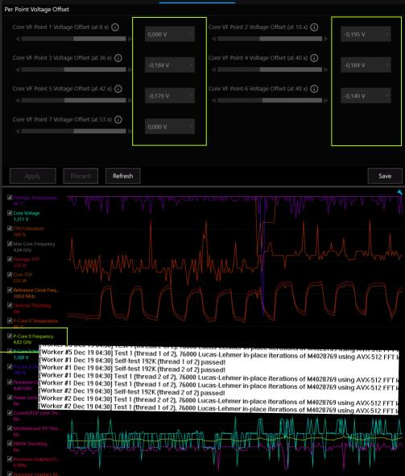
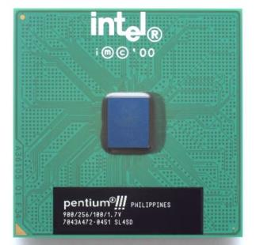
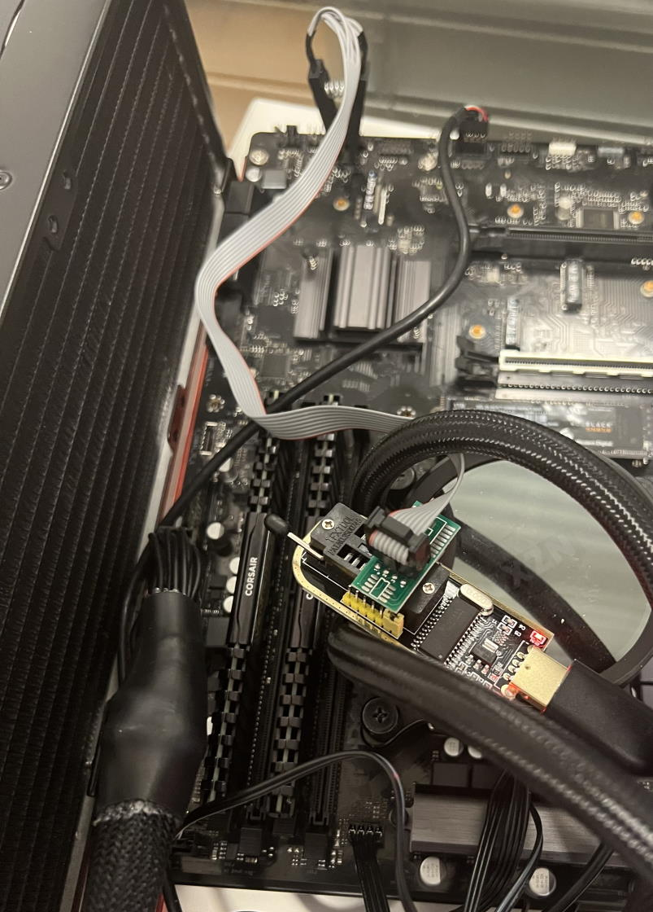
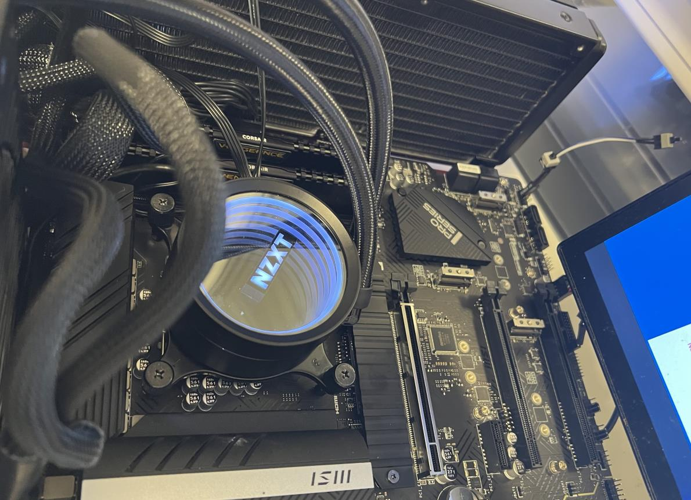
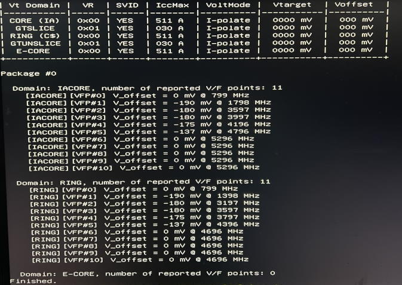
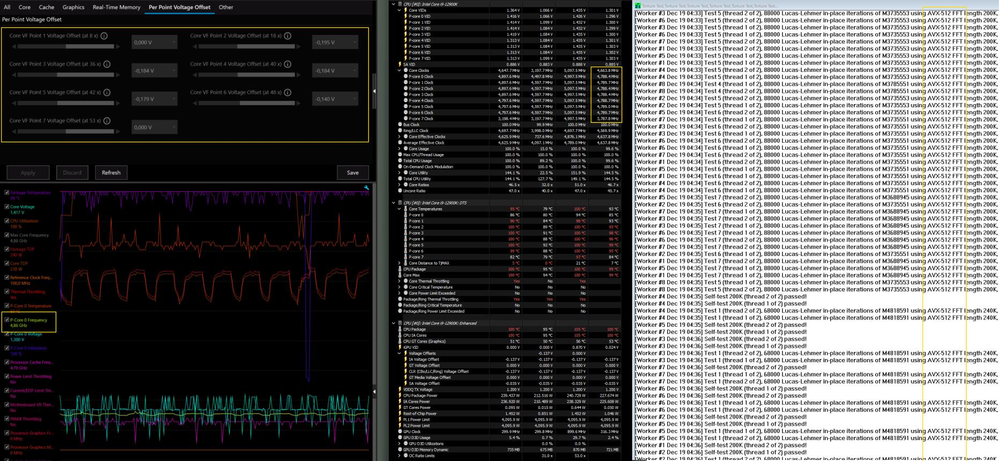
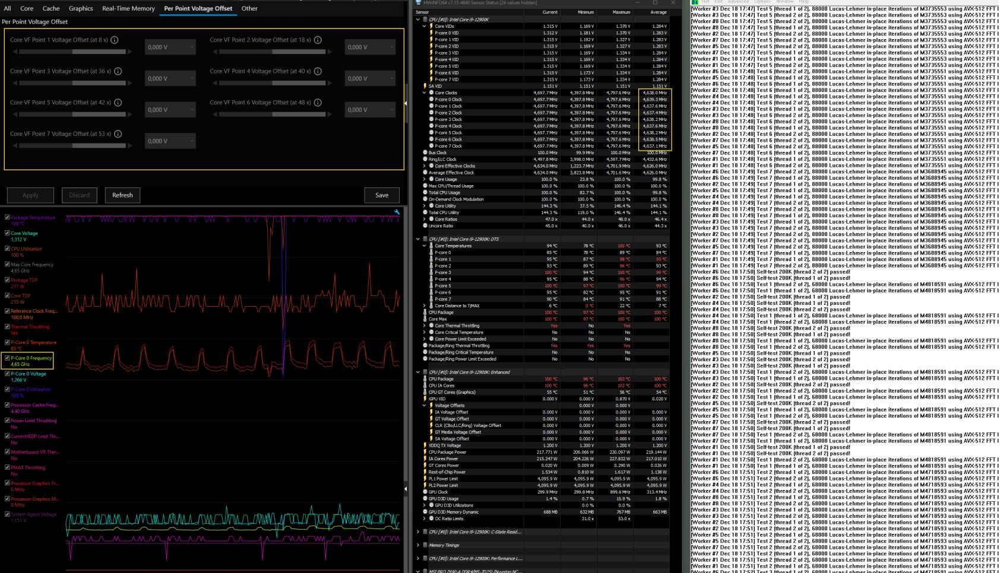

# Advanced Undervolting with V/F Point Adjustment

```txt
   ______                            ______                 _
  (_____ \                          |  ___ \               | |
   _____) )___   _ _ _   ____   ___ | | _ | |  ___   ____  | |  _  ____  _   _
  |  ____// _ \ | | | | / _  ) / __)| || || | / _ \ |  _ \ | | / )/ _  )| | | |
  | |    | |_| || | | |( (/ / | |   | || || || |_| || | | || |< (( (/ / | |_| |
  |_|     \___/  \____| \____)|_|   |_||_||_| \___/ |_| |_||_| \_)\____) \__  |
                                                                        (____/
  Copyright (C) 2021 Ivan Dimkovic. All rights reserved.
  
  WARNING: This code is a proof of concept for educative purposes. It can
  modify internal computer configuration parameters and cause malfunctions or
  even permanent damage. It has been tested on a limited range of target CPUs
  and has minimal built-in failsafe mechanisms, thus making it unsuitable for
  recommended use by users not skilled in the art. Use it at your own risk.
```

- [Advanced Undervolting with V/F Point Adjustment](#advanced-undervolting-with-vf-point-adjustment)
  - [IMPORTANT NOTE](#important-note)
  - [TL;DR - For the Inpatient](#tldr---for-the-inpatient)
  - [Introduction... or what is this V/F thing anyway??](#introduction-or-what-is-this-vf-thing-anyway)
    - [Enter Intel Haswell E(P) and Skylake-X](#enter-intel-haswell-ep-and-skylake-x)
    - [Comet Lake, Signs of Trouble and maybe an unexpected solution?](#comet-lake-signs-of-trouble-and-maybe-an-unexpected-solution)
    - [Unlocked Comet Lake also brings unlocked access to V/F Curve!](#unlocked-comet-lake-also-brings-unlocked-access-to-vf-curve)
    - [V/F Points Exposed - what can we do with them?](#vf-points-exposed---what-can-we-do-with-them)
  - [PowerMonkey.efi 0.1.8 and AVX-512 Prime95 at 4.85 GHz!](#powermonkeyefi-018-and-avx-512-prime95-at-485-ghz)
    - [Preparation of the Test Systems](#preparation-of-the-test-systems)
    - [Rocket Lake](#rocket-lake)
    - [Alder Lake (P-Core Only!)](#alder-lake-p-core-only)
    - [Core i9-12900K (P-Core Only) Results](#core-i9-12900k-p-core-only-results)
    - [Conclusion](#conclusion)

## IMPORTANT NOTES

| Draft Article  |
| ------------- |
| This article is still a draft and will undergo further revisions, for improving clarity and correcting errors. AVX-512 is not part of the released Core i9-12900K specification, and here is used for testing purposes only. |

| Trademarks and Copyrights  |
| ------------- |
| All product names, logos, and brands are property of their respective owners. All company, product and service names used in this website are for identification purposes only. Use of these names, logos, and brands does not imply endorsement. |
|3D XPoint, Altera, Arc, Arria, Avalon, Axxia, Barefoot Networks, the Barefoot logo, the Footsie logo, BunnyPeople, Celeron, Cilk, Cyclone, Do something wonderful., Docea, eASIC, easicopy, Enpirion, Hyperflex, Intel, the Intel logo, Intel Adaptix, Intel Agilex, Intel Atom, Intel CoFluent, Intel Core, Intel Evo, Intel Inside, the Intel Inside logo, Intel Optane, Intel RealSense, Intel Shooting Star, Intel SpeedStep, Intel Unite, Intel vPro, Iris, Itanium, Killer, MAX, Movidius, Myriad, Nios, OpenVINO, the OpenVINO logo, Pentium, Quark, Quartus, Simics, SmartByte, SoftSilicon, Sound Mark, StarPro, Stratix, the Stratix logo, Stay With It, the Engineering Stay With It logo, StreamSight, The Journey Inside, Thunderbolt, the Thunderbolt logo, Tofino, Transcede, Ultrabook, VTune, and Xeon are trademarks of Intel Corporation or its subsidiaries.|

## TL;DR - For the Inpatient



## Introduction... or what is this V/F thing anyway??

Older ones among us will undoubtedly remember easier times when CPUs used to run on a single voltage - supplied by the motherboard, no ifs, and no buts. Those days were simple, but let’s not forget that those 386 and early 486 CPUs ran on 5 volts (yes, five!).

| Pentium III|
|:----------:|
||
| From the happy days when CPUs had working voltage written on them...|

As innovations kept coming, CPUs finally became tiny computers - with embedded RAM, RAM controllers, I/O, GPUs, and more. Trivia: did you know that your CPU has an entirely independent processor responsible for the power management of the main CPU only and that it runs its software (pcode)?

This little processor (called PMC) "wakes up" way before the main CPU executes a single instruction!  All new complexity, not to mention massive advancements in modern CPU operating frequency and number of cores - requires way more advanced and complex logic for maintaining stable power, yet ensuring that the power draw is as low as possible.

PMC capabilities employed to maintain low power and stable high performance mainly were a CPU vendor secret and not even disclosed to the computer manufacturers beyond their "need to know.". PMC was truly living in deep underground, known only by those who work with it directly.

However, something happened, and we slowly got more info and then *some* control over this topic!

### Enter Intel Haswell E(P) and Skylake-X

Intel Haswell-EP (server), also known as Haswell-E in the high-end desktop segment was the first generation where a special CPU register (so-called MSR - in this case MSR 0x150, as registers must have a number to be addressed) directly controlling CPU voltage was opened to system vendors. MSRs are used for various purposes as a way for CPU to communicate with the lowest level software such as BIOS/Firmware and the OS Kernel.

At the time of Haswell-E/EP, MSR 0x150 was simply known as "FIVR control MSR (or something like that)." During Skylake time, it also became known as "Overclocking Mailbox" (mailbox means it is not just a register, but a communication apparatus between different domains - more on that later).

MSR 0x150 gained many functions over time, but the most important ones at the beginning had to do with the voltage control. With MSR 0x150, the "V/F curve" discussion finally entered the realm outside the CPU vendor facilities. Skylake brought the ability to perform "offset" correction of the V/F curve as, by that time, it became necessary to provide more sophisticated voltage controls to overclockers and system builders of unique "tuned" systems ("tuned" as in "tuned above manufacturer’s warranty range").

So, finally, what >is< this V/F curve we keep mentioning?

**Take a look:**


Simply put, the V/F curve is a table (actually, it is most likely more than one table internally) containing information about stable voltages for every supported operating point of the CPU. We can treat it as a basic 2D table with one voltage per operating frequency for simplicity reasons.

In reality, matters are much more complex - PMC must apply real-time corrections to the V/F curve, depending on the current temperature, types of workload being executed and other things such as: other circuits sharing the same voltage regulator, time since the last change (due to ramp-up, ramp-down), etc.

This complexity also explains why users were given very basic control over MSR 0x150 - that interface is just an abstraction, acting as a "gatekeeper" between 3rd parties (as in "not CPU architects") and PMC itself. After offsets were sent via MSR 0x150 in Skylake/Kaby Lake/Coffee Lake era, PMC would re-calculate the internal V/F curve, ensuring consistency and set the final (hidden) values. Some basic consistency checking was there - but, as everybody who did undervolting knows, it is very thin. Whoever uses this MSR shall know very well what they are doing. Wrong actions lead to crashes or hang without any forewarning.

For voltage control, software like [Intel's XTU](https://www.intel.com/content/www/us/en/download/17881/intel-extreme-tuning-utility-intel-xtu.html)
 or [ThrottleStop](https://www.techpowerup.com/download/techpowerup-throttlestop/) use MSR 0x150.

Undervolting is a technique not so relevant on the high-end desktop due to adequate cooling. Still, it was proven to be popular among enthusiasts in the notebook space, sometimes eliminating thermal throttling and making notebooks much faster and cooler - putting even some original equipment manufacturers to shame!

A brief hiccup with the arrival of [Plundervolt exploit](https://plundervolt.com/) demonstrated how MSR 0x150 could be used for more nefarious deeds, prompting industry-wide "patching" of unfetered access to Overclocking Mailbox and thus disabling undervolting on many laptops. But the bigger problem was just arriving!

### Comet Lake, Signs of Trouble and maybe an unexpected solution?

Intel's 10th Gen "Comet Lake" CPUs arrived in 2020 - just a few months after the infamous Plundervolt communique and subsequent OEM patches. Notebook users who were lucky to have their systems still unlocked for undervolting were reporting miserable results compared to previous generations of the CPUs - [some finding even 50 mV core voltage drops sufficient for occasional crash!](https://download.schenker-tech.de/temp/BIOS_and_Tuning_Warning_and_Guide_Intel-Comet-Lake.pdf) It seemed that the days of easily fixing notebook throttling with a voltage drop were finally over.

Did we reach levels of CPU tuning where the chips come out of the factory very near their absolute limits? If one applies knowledge gained from the overclocking community, the answer would seem to be "yes".

**But did we?**

No, we did not! And the same Comet Lake architecture also offered a way to prove it!

### Unlocked Comet Lake also brings unlocked access to V/F Curve

While it is not widely known, Intel Comet Lake CPUs were the first to expose fine-grained control over the V/F curve to 3rd parties. In subsequent new CPU generations, this capability has been (and still is) reserved only for "OC unlocked" CPUs - so the K, KX, etc., models. Lower models do not even allow reading the V/F point values (!).

What is this new capability, and why is it so essential for proving that undervolting was not dead?

Simply put, Intel extended MSR 0x150 to allow customers to fine-tune the V/F curve for working frequencies. Instead of one crude global voltage offset, it became possible to apply custom voltage offsets per different Voltage/Frequency points (V/F Points).

Sounds cool, but how this proves anything about undervolting?

### V/F Points Exposed - what can we do with them?

Let’s take a look again at the picture shown before:


The blue line is the factory-programmed V/F curve. This curve was fused when the CPU was manufactured and underwent testing. Automated Testing System executed a number of workloads and determined the V/F curve.

We know that it is possible to go lower than factory-fused voltages. One has to understand that what is stable for you or me (as individuals) is not what is stable for the CPU manufacturer - CPU manufacturer must ensure that CPU runs stable >always and for everybody, at every workload< or some serious things could happen. Think about it for a while - it is a big ask and big responsibility.

Furthermore, CPU manufacturer also probably wants these CPUs as fast as possible out - so it is no surprise CPUs could often be further tuned for an individual and their use-case.

Now, since we were initially given only one value to work with: fixed offset across the entire V/F curve, we had no choice but to always scale >all< V/F points by the same value. With this limitation, we could only produce the black line (light undervolt) or the red line (heavy undervolt). Light undervolt is obviously not very effective, while heavy undervolt…  well, it stopped working during the Comet Lake era, sending your notebook instantly in frozen-land if you attempt to throw 150 mV or, heavens forbid, 200+ mV drop on it.

Now, why would that be? It becomes very obvious if one looks at the graph: if a strong and constant negative voltage offset is maintained when the CPU goes to very low frequencies, it could end up running unstable and crash due to lack of adequate voltage.

Why? Unfortunately, fixed negative voltage offset across the entire V/F curve means that the lowest frequencies (ones that already have low voltage fused, to begin with!) will end up being excessively undervolted. I’ve seen 0.4 volts or less with a workstation Cometlake laptop! It would be great if it were a mobile phone, but it is not.

Comet Lake simply has an aggressive V/F curve coming straight from its the factory - its manufacturing process (14nm with quite some pluses) was optimized to death - low frequencies require voltages unheard-of just a few years ago in the PC industry. I long suspected this as the main culprit of undervolting instability people complained about. Even kind of "proved" it by fixing the operating frequency to 4+ GHz, and keeping CPU busy so that even 150 mV undervolt was not a problem.

But what is the point of killing lower frequencies and forcing the system always to be busy? This kills the whole reason to undervolt anyway.

Coincidentally (or not?) - Comet Lake’s V/F point access would allow us actually to test the above hypothesis and even fix the problem entirely - undervolting only operating points where undervolting makes sense!

Sounds like too good to be true? Well, it sort of is still - remember what was written above: "OC Unlocked" SKUs only. But that is something for now - and maybe the industry will listen, and we get this control on lower SKUs as well…

## PowerMonkey.efi 0.1.8 and AVX-512 Prime95 at 4.85 GHz

### Preparation of the Test Systems

To ensure proper support, I used both Rocket Lake-S and Alder Lake-S CPUs with fully unlocked OC and multipliers and, therefore, V/F curve control. Unfortunately, I could get any OC-unlocked Comet Lake or Tiger Lake systems, but I see no reason why they would not work.

| Rocket Lake| Alder Lake-S|
|:----------:|:-----------:|
|||
| Rocket Lake Lake Motherboard undergoing CPR due to bad flash (one of many)|Alder Lake Setup - Not quite a notebook, though...|

So, let’s look at the recipe - to start with, we need to extract the V/F point frequencies - usually, system BIOS will do it for you if the motherboard vendor was nice enough to include V/F Point programming in the BIOS. Some of them are not, and relegate this feature for expensive motherboards only… some others are not even aware of this feature so YMMV…

**Here are reference values for the CPUs used in this test:**

### Rocket Lake

<details>
  <summary>Click to expand!</summary>
| | CORE | RING|
|:--: |:----------:|:-----------:|
| V/F Pt. #1 | 8x | 8x |
| V/F Pt. #2 | 25x | 23x |
| V/F Pt. #3 | 35x | 32x |
| V/F Pt. #4 | 43x | 40x |
| V/F Pt. #5 | 46x |     |
| V/F Pt. #6 | 48x |     |
| V/F Pt. #7 | 51x |     |
| V/F Pt. #8 | 51x (OC) |     |
| Total | 8 |  4   |
</details>

### Alder Lake (P-Core Only!)

<details>
  <summary>Click to expand!</summary>
  
| | P-CORE | RING|
|:--: |:----------:|:-----------:|
| V/F Pt. #1 | 8x | 8x |
| V/F Pt. #2 | 18x | 14x |
| V/F Pt. #3 | 36x | 32x |
| V/F Pt. #4 | 42x | 36x |
| V/F Pt. #5 | 48x | 38x |
| V/F Pt. #6 | 53x | 43x |
| V/F Pt. #7 | 53x (OC) | |
| Total | 8 |  7   | 6
</details>

Remember, always cross-check with your own hardware!

After V/F points are known, it is time to test the CPU to determine stable voltages for each V/F point. You can do this in many ways;  I was lazy and just patched the [Plundervolt script](https://github.com/KitMurdock/plundervolt/blob/master/utils/find_crash_point.sh) (some good out of it at the end) with slightly better control of the CPU states and Prime95 run for every test. Then I let it run in a mini Linux distro that auto-boots after each crash…

To ensure coverage, I actually ran three tests (SSE only, AVX and AVX-512) as those have very different power demands, and PMC could handle them differently in terms of voltages and frequencies.

If you do this, please ensure you disable all CPU-assisted frequency scaling and power management and keep monitoring tests for throttling (try avoiding it) - otherwise, your newly found voltages will not represent reality.

My script includes a run of Prime95 (or mprime in Linux) with silly AVX-512 load for every tested voltage. Overkill? Probably, but it is for testing only. Nevertheless, I suggest longer test cycles and making them as stressful for the CPU as possible because you do not want an unstable CPU.

**What I got out of Plundervolt script run are the following, for each V/F point:**

- Crash voltages for AVX-512 workloads
- Crash voltages for AVX workloads
- Crash voltages for SSE workloads

At this point, one can take the worst cases of these, add a "buffer" considered necessary / safe - and program the new values. I use PowerMonkey.efi since we are also validating the support for V/F points at the same time - so, let’s change `CONFIGURATION.C`:

```cpp
    ///
    /// CPU: Alder Lake-S 12900K PRQ
    /// Autotune script: prime95_ultrashort
    /// 
    /// Crash offsets (in mV) per VF point:
    ///
    ///          0.8GHz  1.8GHz  3.6GHz  4.0GHz  4.2GHz  4.8GHz  5.3GHz
    /// AVX512:     N/A    -244    -238    -225    -235    -190     N/A
    /// AVX2        N/A    -240    -230    -214    -230    -170     N/A
    /// SSE         N/A    -250    -246    -232    -238    -186     N/A
    
    pk->planes[IACORE].vfPoint[0].VOffset =
      pk->planes[RING].vfPoint[0].VOffset = 0;     // V_Offset (mv) @ 800 MHz

    pk->planes[IACORE].vfPoint[1].VOffset =
      pk->planes[RING].vfPoint[1].VOffset = -190;  // V_Offset (mv) @ 1800 MHz

    pk->planes[IACORE].vfPoint[2].VOffset =
      pk->planes[RING].vfPoint[2].VOffset = -180;  // V_Offset (mv) @ 3600 MHz

    pk->planes[IACORE].vfPoint[3].VOffset =
      pk->planes[RING].vfPoint[3].VOffset = -180;  // V_Offset (mv) @ 4000 MHz

    pk->planes[IACORE].vfPoint[4].VOffset =
      pk->planes[RING].vfPoint[4].VOffset = -175;  // V_Offset (mv) @ 4200 MHz

    pk->planes[IACORE].vfPoint[5].VOffset =
      pk->planes[RING].vfPoint[5].VOffset = -137;  // V_Offset (mv) @ 4800 MHz

    pk->planes[IACORE].vfPoint[6].VOffset =
      pk->planes[RING].vfPoint[6].VOffset = 0;     // V_Offset (mv) @ 5300 MHz

```

**Let's also not forget to enable V/F Point programming:**

```cpp
    pk->Program_VF_Points[IACORE] =                 // 0 - Do not program
      pk->Program_VF_Points[RING] = 1;              // 1 - Program
                                                    // 2 - Print current values                                                    
                                                    //     (2 does not program)

    // Hybrid Architectures (Alder Lake +): E-Cores

                                                    // 1 - Program
    pk->Program_VF_Points[ECORE] = 1;               // 0 - Do not program
                                                    // 2 - Print current values                                                    
                                                    //     (2 does not program)
```

**And also, let's switch off legacy (one value for the entire V/F curve) programming:**

```cpp
    pk->planes[IACORE].VoltMode =
      pk->planes[RING].VoltMode = V_IPOATIVE;      // V_IPOLATIVE = Interpolate
                                                   // V_OVERRIDE =  Override
    pk->planes[IACORE].TargetVolts =
      pk->planes[RING].TargetVolts = 0;            // in mV (absolute)

    pk->planes[IACORE].OffsetVolts =
      pk->planes[RING].OffsetVolts = 0;            // in mV 
                                                   // (negative = undervolt)
```

As you can see, I enabled VF Point programming and entered my new V/F point voltage offsets, based on the Alder Lake test results (I am skipping Rocket Lake in this article for brevity, it is the same procedure). I took the AVX and SSE crash zones, and added a sizable buffer to steer clear of them, then ran some more tests to reach the values above.

All of this leads to the following picture:


The most important bit in the picture above are the first and the last V/F points - you can see that they are left unused, with no voltage drop applied. This is to hint to the PMC that we have no business in undervolting the CPU further in its lower frequency range (or the highest/OC for that matter).

After recompiling ```PowerMonkey.efi```, running it pre-boot - we are greeted with this new screen:



Lovely, looks like our values are at least programmed. Let’s now boot in Windows and see what have we done!

### Core i9-12900K (P-Core Only) Results

Since the test systems are not thermally limited (by no means, thanks to that 360mm water cooling rig), it is tough to see the benefit of undervolting. For this, in the future I will test the CPU in "pretend notebook" state with their energy / thermal limits imposed artificially as the next step…

But for now, let’s ask the following question:

What is the all-core maximum clock at which the system will continuously run AVX-512 energy virus?

If undervolting works, CPU shall run at higher frequencies if there is thermal headroom, which we will validate right now with Prime95 and PowerMonkey.efi undervolt!

This is the result - stock voltages:

**Undervolt:**



**Stock:**



What you are seeing above is Core i9-12900K being pounded with AVX-512 Prime95 workload (some people prefer to call it 'power virus', althougth I do not think it is fair) and, trust me, I picked the worst-case of them all: Small FFTs test.

And, yet, with our V/F point undervolt it manages to run on ~4.8 GHz on average - this, 100% "power virus" CPU load, all cores >and< AVX-512! Stock configuration runs 150 MHz lower - at ~4.65 GHz

To verify this is not some sort of fluke, we can simply test the impact of -0.137v voltage drop durin the workload, and see how will this affect PMC and its decisions about allowed clocks:


As we can see, gain in maximum frequency is almost instant as soon as voltage is dropped. PMC immediately calculates that is is safe to bump-up core  another 150-200 MHz.

### Conclusion

TBD...
